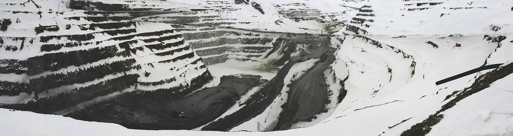

# Repositorio de clases: Asignatura de "Análisis de Datos" para mis alumnos de Ingeniería Civil en Minería.
---
En este repositorio se almacenan las clases para la asignatura **Análisis de Datos** que dicto a mis alumnos de la carrera de Ingeniería Civil en Minería de la Universidad del Desarrollo, en la forma de notebooks de Jupyter.

La asignatura tiene como objetivo el desarrollo, mediante teoría y ejemplos, de ciertas habilidades que nos permitan utilizar el lenguaje de programación Python para proponer soluciones a una enorme cantidad de problemas mediante el análisis de datos, entendiéndose ésto último como un proceso (normalmente secuencial) de exploración, transformación y (en algunos casos) modelamiento de datos con el propósito de obtener información valiosa a partir de ellos, a fin de concluir ciertos resultados importantes y dar un apoyo robusto a procesos claves de toma de decisión.

La herramienta fundamental desarrollada, y por supuesto utilizada, en esta asignatura, es el lenguaje de programación Python. De esta manera, se introducen varias librerías que (humildemente) se juzgan como esenciales en el contexto del análisis de datos, tales como **Numpy** y **Pandas**, las cuales se tratan en detalle, desde la presentación de sus estructuras más fundamentales y su conexión con objetos matemáticos tales como vectores y matrices, hasta varias implementaciones de técnicas clásicas que nos permiten explorar, manipular y limpiar datos, además de construir algunos modelos sencillos. Una vez desarrollados los fundamentos y funcionalidades más esenciales de estas librerías, pasamos a introducir a **Matplotlib** como herramienta de visualización y reportabilidad. Finalmente, introducimos algunas librerías más dedicadas a análisis de tipo numérico (como **Scipy**) y simbólico (como **Sympy**), con foco en cuestiones relativas a estadística, optimización e interpolación.

---
## ¿A quién va dirigido este repositorio?
Este repositorio fue construido pensando en colegas mineros, ya sea estudiantes o profesionales, que deseen aprender estos contenidos y tengan algunas reticencias relativas al hecho de programar y/o utilizar herramientas técnicas que muchas veces no son comunes en el quehacer del minero, ya sea en la propia operación como en áreas más estratégicas. 

Me tomaré la licencia de ser un tanto autorreferente en este punto, debido a que considero justo el subrayar la razón por la cual me he preocupado de construir este repositorio (y otros más de este mismo tipo que están por venir). Durante mi tiempo como estudiante (2007 - 2013), únicamente tuve una asignatura relacionada con la programación, en la cual a duras penas logré aprobar después de entender (con mucho esfuerzo) cómo hacer operaciones muy básicas usando QBasic. No me fue muy bien, ya que siempre he sido extremadamente literal a la hora de entender el lenguaje (en toda su extensión), y cuando mi profesor escribió en la pizarra la expresión $i=i+1$, mi cabeza literalmente explotó. Fue peor aún cuando él me dijo que dicha expresión representaba *un contador*. Mi cerebro sólo podía imaginar, en toda su literalidad, a una persona realizando contabilidad en una empresa, lo que me hizo desarrollar un miedo enorme al hecho de *tener que programar*. Sin embargo, siempre fui muy *nerd* para las matemáticas y eso me ayudó muchísimo para entender que tarde o temprano, cuando quisiera construir herramientas de mayor complejidad, requeriría herramientas que me forzarían a hacer lo que tanto temía. Y que debía pensar en la programación como una aliada de gran poder.

No fue en absoluto fácil. Pero la sencillez de Python en su aprendizaje fue de extrema ayuda para mi cerebro tan compungido por expresiones como $i=i+1$. No negaré que aún me siento raro al aplicarlas, a pesar de entender perfectamente su significado.

Pero en fin. Estos apuntes van dirigidos (vuelvo a ofrecer disculpas por la autorreferencia) a aquellos estudiantes o profesionales que ven con reticencia a estas herramientas o, en palabras más profundas, a mi yo de hace unos años con un poco de miedo ante el vasto mundo detrás de las líneas de código. El objetivo es transmitir que, si bien aprender a usar Python para *analizar concienzudamente nuestros datos* no es precisamente un paseo por el parque, sí se trata de una aventura divertida y muchas veces excitante. Sobretodo cuando las soluciones que visualizábamos apenas en nuestra cabeza toman forma en la salida de nuestro código. Por supuesto, intento hacer el esfuerzo de que estos apuntes tengan una orientación que privilegie la resolución de problemas en el contexto del negocio minero y metalúrgico (en temas extractivos). De esta manera, haremos análisis exploratorios de datos de planificación, operación e incluso geomecánicos; construiremos curvas de tonelaje versus ley; haremos análisis estadísticos de datos operacionales; visualizaremos el crecimiento de una cavidad conforme la producción de una mina subterránea crece y su interacción con la sismicidad inducida por la minería; estimaremos leyes en un modelo regularizado a partir de datos de sondajes; y muchas otras cosas que en el común de los casos requerirían de algún software costoso, simplemente haciendo uso de Python.

Todo lo malo que esté en estos apuntes se debe a mi persona, y cualquier feedback de fondo y/o forma será siempre bien recibido (mi correo es rene.quezadac@gmail.com). Todo lo bueno, se debe a los grandes profesionales con los que he tenido la oportunidad de trabajar y aprender de ellos. Por supuesto, y como siempre, reitero mi profundo agradecimiento a todos quienes han depositado en mí su confianza para apoyarlos como parte de un equipo de trabajo. Para mí, siempre será un honor contar con la confianza de un colega.

---
## Requisitos.
Como comenté previamente, estos apuntes tienen como público objetivo a estudiantes y profesionales del mundo de la minería. Sin embargo, no habrá ningún problema en entender su contenido para cualquier profesional afin a la ingeniería. Digo *afín* porque, al fin y al cabo, en estos apuntes se asume un conocimiento básico de Python y de asignaturas típicas de un plan común de ingeniería, tales como cálculo, álgebra lineal, estadística y probabilidad. Se hará el intento de darle background a casi todo, pero debido a que éste es un curso pensado para un esquema semestral de un día a la semana, en algunos casos deberemos recurrir al pragmatismo (¡mis alumnos son mi prioridad!). Sin embargo, la literatura que versa sobre el transfondo matemático inherente a lo que desarrollaremos vía código es rica y variada. Y no deseo caer en la presunción de ofrecer apuntes de estos temas más elementales. Aunque quien sabe... :)

---
## Instalación.
Como se comentó en un principio, estos apuntes constan de notebooks de Jupyter, los que fueron testeados usando Python 3.9.16, a partir de un entorno de Anaconda 23.1.0. Anaconda es una distribución de Python (y R) para la computación científica que incluye varias librerías utilizadas en estos apuntes por defecto. Anaconda está disponible para Windows, Mac OS y distribuciones de Linux en [este link](https://www.anaconda.com/download/).

En nuestra terminal podremos clonar este repositorio rápidamente mediante la instrucción

`git clone https://github.com/rquezadac/udd_data_analytics_lectures.git`

La instalación de las dependencias está disponible por medio del archivo `requirements.txt`, mediante la instrucción:

`pip install requirements.txt`

La cual debe imputarse en nuestra terminal (ya contando con una instalación de Python).

---
## Acerca del autor.
Mi nombre es René Quezada Castañeda. Tengo 35 años y soy ingeniero civil en minas de la Universidad de Santiago de Chile. Actualmente me desempeño como especialista de business analytics en la Subgerencia de Business Insight de Minera Candelaria, y tengo 7 años de experiencia trabajando en diversas faenas mineras y en los más diversos proyectos de analítica avanzada, incluyendo operaciones a cielo abierto y subterráneas y plantas concentradoras. Me gustan las matemáticas, el cine y los libros. Amo la ciencia ficción. Soy fanático de la obra literaria de Isaac Asimov, Philip Pullman, Philip K. Dick y Stanislaw Lem. Soy muy autodidacta, la mayoría de los temas asociados a esta hermosa disciplina los he aprendido en base a tutoriales, cursos, apuntes y mucho mucho estudio. Vengo de una familia pequeña, conformada por mis viejos –a quienes adoro– y yo. Soy papá de una gata (Lyra, como la protagonista de *La Materia Oscura*) y dos conejas (Capuchino y Fey). Soy preguntón, sufro de síndrome del impostor (gracias a mis colegas y amigos por recordarme siempre que puedo resolver cualquier problema), me gusta el rock y la música electrónica, amo el invierno y los videojuegos.